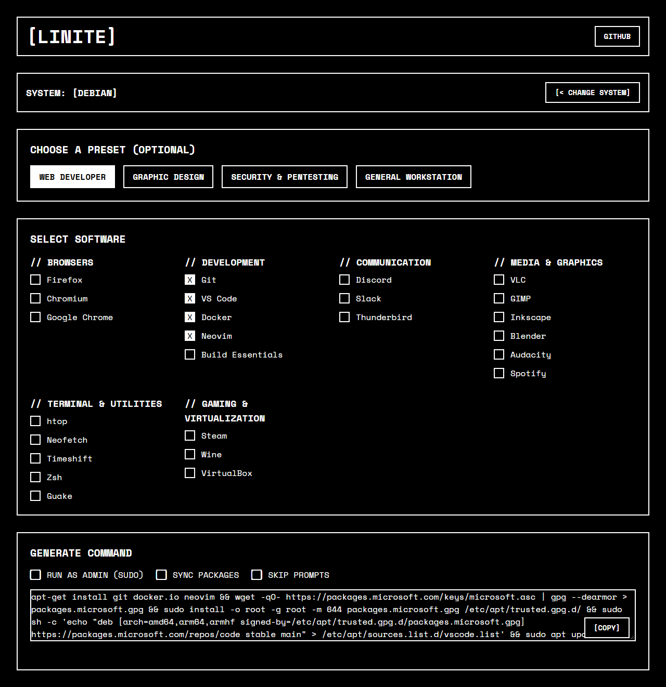

# [LINITE]

A fast, minimalist web app for generating batch-install commands for your favorite Linux software, inspired by the popular Windows utility [Ninite](https://ninite.com/).

### **[Live Website →](https://jampanikomal.github.io/linite/)**

---

Linite streamlines the process of setting up a new Linux machine. Instead of installing applications one by one, you can select everything you need from a curated list, and Linite will generate a single, ready-to-paste command for your specific distribution.

## Features

-   **Smart Selection:** Choose your system by its base (Debian, Fedora, Arch) or by its specific name (Ubuntu, Kali, Manjaro, etc.).
-   **Installation Presets:** Use one-click presets for common roles like "Web Developer" or "Graphic Design" to get started even faster.
-   **Dynamic Command Generation:** The install command is built in real-time as you select software and configure options.
-   **Modern & Lightweight:** Built with vanilla JavaScript and no dependencies for maximum speed.
-   **Client-Side Privacy:** The entire application runs in your browser. No data is ever sent to a server.

## How to Use

1.  Go to the [**Linite website**](https://jampanikomal.github.io/linite/).
2.  Select your Linux distribution from one of the two menus.
3.  Choose a preset or manually select your desired software.
4.  Configure the command options (e.g., add `sudo`).
5.  Copy the generated command and run it in your terminal.

## Contributing

This project is open to contributions! The easiest way to help is by expanding the software and distribution lists. All application data is stored in simple `.json` files in the `/data/` directory.

1.  Fork the repository.
2.  Add a new application:
    -   Add the app's metadata to `data/global.json`.
    -   Add the package name to `data/debian.json`, `data/fedora.json`, and `data/arch.json`. If a package doesn't exist for a distro, use `null`.
3.  Submit a pull request with a clear description of your changes.

## Testing & Verification

Ran the live app end to end (served locally, driven with Playwright) rather
than just reading the code. Found and fixed a real bug: selecting a preset
(e.g. "Web Developer") silently dropped any app that only has a "complex"
multi-step install (VS Code, Google Chrome, Discord, Slack, Spotify are
`null` in every distro's simple package map and only installable via
`data/*-complex.json`). The preset-matching logic only checked the simple
package map, so `["git", "vscode", "docker", "neovim"]` generated a command
for `git docker.io neovim` only — VS Code silently missing, even though its
own checkbox in the regular software grid correctly shows it as available.
Fixed by introducing one shared `isAppAvailable()` check (matching what the
checkbox grid already used) and applying it consistently across preset
selection, preset-active-state matching, and the distro-switch carry-over
logic. Verified before/after with a real preset click on Debian: command
went from missing VS Code entirely to including its full install sequence.

## Known Limitations

- `data/debian-complex.json` pins a specific Slack `.deb` version/URL rather
  than a version-agnostic download link, so it can go stale if Slack
  retires that release.
- No offline/PWA support yet — requires a network connection to load the
  `data/*.json` files.
- Package availability data is manually maintained; a typo'd or renamed
  package name in the JSON files won't be caught automatically.

## License

This project is open source and available under the [MIT License](./LICENSE).

## Future Roadmap
- [ ] **PWA Conversion:** Convert to Progressive Web App for offline usage.
- [ ] **Framework Migration:** Refactor vanilla JS to React/TypeScript for scalability.
- [ ] **User Accounts:** Backend validation for saving custom package lists.
